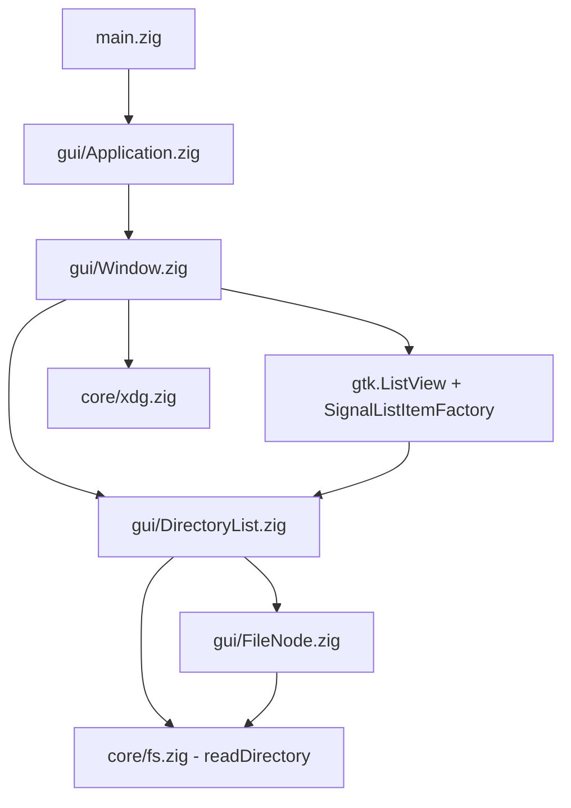

# Implementation Plan — Filebender Milestone 1: Bare Minimum Directory Browser

## Problem Statement

Build the simplest possible native Linux file manager: an AdwApplication window that lists file names in a directory and lets you navigate by clicking into directories or clicking `../` to go up — using GObject-first patterns from Zig via `zig-gobject` bindings, targeting Zig 0.16+.

## Requirements

- GTK4/libadwaita application using GObject type system from Zig
- `zig-gobject` (upstream `ianprime0509/zig-gobject`) patched for Zig 0.16
- Directory listing via `std.Io` in core (pure Zig, no GLib for filesystem ops)
- `FbFile` / `FbFileInfo` structs in core using `std.Io.File.Stat`
- Simple list view showing file names only
- Navigate into directories by clicking, navigate up via `../` or button
- Start at `$HOME` via XDG resolution
- Minimal dependencies: only GTK4, libadwaita, and their transitive deps (for GUI only)

## Architecture

### Two-Layer Split

- `core/` — Pure Zig, `std` only. Filesystem interaction, data types, formatting.
- `gui/` — All GLib/GTK/libadwaita dynamic library code. GObject wrappers, widgets, app lifecycle.

**Rule:** `gui/` imports from `core/`. `core/` never imports from `gui/` or any GLib/GTK module.

### Core Data Types (already in progress)

```zig
// core/fs/FbFileInfo.zig — raw stat metadata
FbFileInfo {
    size: u64,
    mode: u32,
    uid: File.Uid,
    gid: File.Gid,
    atime: ?Io.Timestamp,
    mtime: Io.Timestamp,
    ctime: Io.Timestamp,

    pub fn fromStat(stat: File.Stat) FbFileInfo
}

// core/fs/FbFile.zig — a filesystem entry
FbFile {
    parent: ?*const FbFile,
    kind: Io.File.Kind,
    info: FbFileInfo,
    path: []const u8,
    mime_type: ?[]const u8,
    symlink_target: ?[]const u8,

    pub fn basename() []const u8      // derived via std.fs.path.basename
    pub fn dirname() ?[]const u8      // derived via std.fs.path.dirname
    pub fn isHidden() bool            // name starts with '.'
    pub fn isBackup() bool            // name ends with '~'
}
```

### Project Structure

```
src/
  main.zig                      # Entry point
  root.zig                      # Library root (filebender module)

  core/                         # Pure Zig — std.Io only
    fs.zig                      # Module root, readDirectory functions
    fs/
      FbFile.zig                # Filesystem entry struct
      FbFileInfo.zig            # Stat metadata struct

  gui/                          # All GLib/GTK/libadwaita code
    main.zig                    # Module root
    Application.zig             # Custom AdwApplication subclass
    Window.zig                  # Custom AdwApplicationWindow subclass
    DirectoryList.zig           # GObject implementing gio.ListModel
    FileNode.zig                # GObject wrapping FbFile + app state
```

### Data Flow

```
core/fs.readDirectory(alloc, io, parent)     # std.Io: openDirAbsolute + iterate + stat
core/fs.readDirectoryFromPath(alloc, io, path)
  → []FbFile                                 # Plain Zig structs

gui/DirectoryList                            # GObject implementing gio.ListModel
  calls core readDirectory functions
  wraps each FbFile → gui.FileNode GObject

gui/Window                                   # AdwApplicationWindow
  binds DirectoryList to gtk.ListView
  displays file names
  handles click-to-navigate
```

### Dependency Diagram



## Task Breakdown

### Task 1: Integrate zig-gobject bindings and fix Zig 0.16 compatibility

- **Objective:** Get the project building with zig-gobject bindings on Zig 0.16
- Download `bindings-gnome49.tar.zst` (or gnome48) from zig-gobject v0.3.1 release
- Extract as local directory (e.g. `deps/gobject/`)
- Add as local path dependency in `build.zig.zon`
- Rewrite `build.zig` to use gobject dependency for module imports (`glib2`, `gobject2`, `gio2`, `gtk4`, `adw1`)
- Fix any Zig 0.16 breakage in bindings or build system API
- Create `src/gui/main.zig` module root
- Verify with minimal `const adw = @import("adw");`
- **Test:** `zig build` succeeds on Zig 0.16
- **Demo:** Project compiles and runs without crashing

### Task 2: Create custom AdwApplication subclass and empty window

- **Objective:** Establish the GObject-first application structure
- Create `src/gui/Application.zig` — custom GObject class extending `adw.Application` via `gobject.ext.defineClass`
- Implement `gio.Application.virtual_methods.activate` to create and present an `adw.ApplicationWindow`
- Application ID: `"dev.filebender.app"`
- Update `main.zig` to instantiate gui.Application and call `gio.Application.run()`
- **Test:** `zig build run` opens an empty libadwaita window
- **Demo:** Empty AdwApplicationWindow with "Filebender" title

### Task 3: Finish core filesystem layer

- **Objective:** Complete the `core/` data types and directory reading
- Finish `FbFileInfo.fromStat()` — map `Io.File.Stat` fields to FbFileInfo
- Implement `readDirectoryFromPath(alloc, io, path) → []FbFile` using `Io.Dir.openDirAbsolute()`, `iterate()`, `statFile()`
- Implement `readDirectory(alloc, io, parent) → []FbFile` — delegates to inner helper using `parent.path`
- Add `FbFile.deinit(alloc)` for cleanup (free path string, symlink_target)
- Create `src/core/xdg.zig` — resolve `$HOME` via `std.posix.getenv()`
- **Test:** Unit tests for `readDirectory` against a temp directory, `FbFileInfo.fromStat`, XDG resolution
- **Demo:** `zig build test` passes

### Task 4: Create FileNode GObject wrapping FbFile

- **Objective:** Bridge core data into GObject type system
- Create `src/gui/FileNode.zig` — custom GObject class with properties:
  - `name` (string) — basename derived from FbFile.path
  - `kind` (uint) — from FbFile.kind
  - `size` (uint64) — from FbFile.info.size
- Provide constructor: `FileNode.newFromFbFile(file: FbFile) *FileNode`
- Register properties via `gobject.ext.defineProperty`
- **Test:** Create FileNode from FbFile, verify properties readable
- **Demo:** FileNode GObjects can be instantiated and queried

### Task 5: Create DirectoryList implementing gio.ListModel

- **Objective:** Data model that bridges core fs reading to GTK
- Create `src/gui/DirectoryList.zig` — custom GObject implementing `gio.ListModel`
- Has `path` property (string) for current directory
- When path set: call `core.fs.readDirectoryFromPath()`, wrap each FbFile → FileNode GObject
- Implement `gio.ListModel` virtual methods: `get_item`, `get_item_type`, `get_n_items`
- Fire `items-changed` signal on directory change
- **Test:** Point at known directory, verify item count
- **Demo:** DirectoryList enumerates `$HOME` correctly

### Task 6: Create Window with ListView showing file names

- **Objective:** Display directory contents in a visible list
- Create `src/gui/Window.zig` — custom `adw.ApplicationWindow` subclass
- Add `adw.HeaderBar` with current path as title
- Add "Go Up" button in header bar
- Create `gtk.ListView` inside `gtk.ScrolledWindow`
- Use `gtk.SignalListItemFactory` — setup/bind/unbind showing file name only
- Connect DirectoryList as backing model via `gtk.SingleSelection`
- Initialize with `$HOME` from `core.xdg`
- Update gui/Application.zig to create this Window
- **Test:** `zig build run` shows window listing home directory file names
- **Demo:** Scrollable list of file names

### Task 7: Implement directory navigation

- **Objective:** Click to navigate into/out of directories
- Connect `gtk.ListView` activate signal — if selected item is directory, update DirectoryList path
- Wire "Go Up" button to navigate to parent directory (via `std.fs.path.dirname`)
- Update header bar title on navigation
- Handle edge cases: root directory (disable Go Up), empty directories, permission errors
- **Test:** Navigate into subdirectory, verify list updates; navigate up, verify return
- **Demo:** Full directory browsing — open at $HOME, click into folders, Go Up to return
