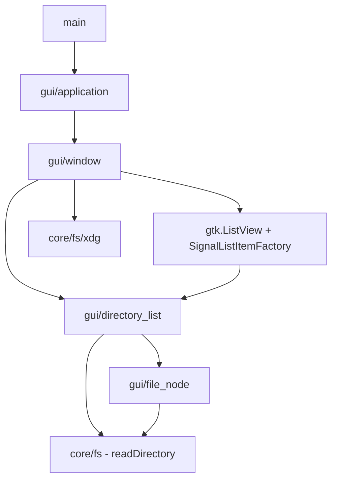

# Implementation Plan — Filebender Milestone 1: Bare Minimum Directory Browser

## Problem Statement

Build the simplest possible native Linux file manager: a libadwaita window that lists
file names in a directory and lets you navigate by clicking into directories or clicking
a "Go Up" button — using GObject-first patterns via C FFI bindings, targeting either
Zig 0.16+ or Odin (dev branch).

## Design Decisions

### Toolkit: GTK4 + libadwaita

GTK4 is a C library with trivial FFI from both Zig and Odin. Qt is C++ with moc
preprocessing and would require an additional C wrapper layer. libadwaita provides
GNOME HIG compliance, adaptive coloring, and dark mode for free. GNOME is the
dominant DE on major Linux distros. This matches the Ghostty precedent (GTK for Linux).

### Language: Zig or Odin (decision pending)

Both languages offer:
- First-class C interop (critical for GTK4 bindings)
- Manual memory management (no GC — predictable performance)
- Comptime/metaprogramming capabilities
- Cross-compilation support
- Growing ecosystems with package managers

**Zig advantages:** zig-gobject provides generated type-safe bindings; `std.Io` offers
a clean filesystem interface; larger community; better tooling maturity.

**Odin advantages:** Simpler language (fewer footguns); vendor:linux bindings exist;
more straightforward build system; less churn in language spec.

This plan presents architecture for both. Language-specific details are marked with
`[Zig]` or `[Odin]` annotations.

### Concurrency Model

Three threads:

1. **Main thread** — GTK4 event loop. All UI access. Calls `filebender_dispatch()` when
   the engine's fd fires (via GSource). Reads `filebender_progress()` on frame ticks.
2. **Engine thread** — Drives io_uring ring. Pops submissions, submits SQEs, blocks on
   `io_uring_wait_cqe()`, writes completions, signals eventfd + futex. Created once at
   engine init.
3. **Worker threads** — Spawned per CPU-bound operation (search, checksums, compression).
   Die on completion.

Synchronization: lock-free SPSC/MPSC queues for submission/completion, atomics for
op status/progress/cancel, futex for `filebender_wait()`, RwLock for directory model
and caches. No mutexes on the hot path.

For Milestone 1, all operations run synchronously on the main thread (directory listing
is fast enough). Engine thread introduced at Milestone 3 with file operations.

### Library Architecture

`core/` is designed from day one with library extraction in mind. It has zero GUI
dependencies and zero toolkit imports. However, the public C-ABI library (libfilebender)
is a post-1.0 formalization effort — the internal API will evolve freely until then.

## Requirements

- GTK4/libadwaita application using GObject type system via C FFI
- [Zig] `zig-gobject` (upstream `ianprime0509/zig-gobject`) for generated bindings
- [Odin] GTK4 bindings via `vendor:linux` or manual `foreign import`
- Directory listing via language-native filesystem I/O in core (no GLib for filesystem ops)
- `FbFile` / `FbFileInfo` structs in core
- Simple list view showing file names only
- Navigate into directories by clicking, navigate up via button
- Start at `$HOME` via XDG resolution
- Minimal runtime dependencies: only GTK4, libadwaita, and their transitive deps

## Architecture

### Two-Layer Split

- `core/` — Pure language code, stdlib only. Filesystem interaction, data types, formatting.
- `gui/` — All GLib/GTK/libadwaita C FFI code. GObject wrappers, widgets, app lifecycle.

**Rule:** `gui/` imports from `core/`. `core/` never imports from `gui/` or any GLib/GTK module.

### Core Data Types

```
// FbFileInfo — raw stat metadata
FbFileInfo {
    size: u64
    mode: u32
    uid: u32
    gid: u32
    atime: ?Timestamp    // last access
    mtime: Timestamp     // last modification
    ctime: Timestamp     // last status change

    fromStat(stat) -> FbFileInfo
}

// FbFile — a filesystem entry
FbFile {
    parent: ?*FbFile
    kind: FileKind       // regular, directory, symlink, fifo, socket, etc.
    info: FbFileInfo
    path: string         // full path
    mime_type: ?string
    symlink_target: ?string

    basename() -> string
    dirname() -> ?string
    isHidden() -> bool   // name starts with '.'
    isBackup() -> bool   // name ends with '~'
}
```

[Zig] Uses `std.Io.File.Stat`, `std.Io.File.Kind`, `std.Io.Timestamp`. Strings are `[]const u8`.
[Odin] Uses `os.Stat`, `os.File_Type`. Strings are `string` (length-prefixed slice).

### Project Structure

```
src/
  main.{zig,odin}              # Entry point
  root.{zig,odin}              # Library root (filebender module)

  core/                        # Pure stdlib — no C deps
    fs.{zig,odin}              # Module root, readDirectory functions
    fs/
      file.{zig,odin}         # FbFile struct
      file_info.{zig,odin}    # FbFileInfo struct
      xdg.{zig,odin}          # XDG directory resolution

  gui/                         # All GLib/GTK/libadwaita code
    main.{zig,odin}            # Module root
    application.{zig,odin}     # Custom AdwApplication subclass
    window.{zig,odin}          # Custom AdwApplicationWindow subclass
    directory_list.{zig,odin}  # GObject implementing gio.ListModel
    file_node.{zig,odin}       # GObject wrapping FbFile + display state
```

### Data Flow

```
core/fs.readDirectory(path)
  -> open directory
  -> iterate entries
  -> stat each entry
  -> return []FbFile (plain structs)

gui/DirectoryList (GObject implementing gio.ListModel)
  calls core readDirectory
  wraps each FbFile -> gui.FileNode (GObject with properties)

gui/Window (AdwApplicationWindow)
  binds DirectoryList to gtk.ListView
  displays file names
  handles click-to-navigate
```

### Dependency Diagram



## Task Breakdown

### Task 1: Project scaffolding and GTK4 bindings

- **Objective:** Get the project building with GTK4/libadwaita bindings
- [Zig] Download zig-gobject bindings, add as local dependency, configure build.zig
- [Odin] Set up foreign import for GTK4/libadwaita, create binding wrappers if needed
- Create directory structure: `src/core/`, `src/gui/`
- Verify with minimal GTK4 import (e.g., `adw_init()` call)
- **Test:** Project compiles and links against GTK4/libadwaita
- **Demo:** Build succeeds without runtime crash

### Task 2: Create custom AdwApplication subclass and empty window

- **Objective:** Establish the GObject-first application structure
- Create `src/gui/application` — custom GObject class extending AdwApplication
- Implement `activate` virtual method to create and present an AdwApplicationWindow
- Application ID: `"dev.kicanter.filebender"`
- Update main to instantiate the application and call `g_application_run()`
- **Test:** Application opens an empty libadwaita window
- **Demo:** Empty AdwApplicationWindow with "Filebender" title

### Task 3: Implement core filesystem layer

- **Objective:** Complete `core/` data types and directory reading
- Implement FbFileInfo struct with `fromStat()` mapping
- Implement FbFile struct with `basename()`, `dirname()`, `isHidden()`, `isBackup()`
- Implement `readDirectory(path) -> []FbFile`:
  - Open directory
  - Iterate entries
  - Stat each entry
  - Return allocated slice of FbFile
- Implement `xdg.homeDir()` — resolve $HOME
- Memory management: FbFile owns its path string, provide `deinit()`/`destroy()` for cleanup
- **Test:** Unit tests for readDirectory against a temp directory
- **Demo:** Tests pass

### Task 4: Create FileNode GObject wrapping FbFile

- **Objective:** Bridge core data into GObject type system for GTK consumption
- Create `src/gui/file_node` — custom GObject class with properties:
  - `name` (string) — basename from FbFile.path
  - `kind` (uint) — from FbFile.kind
  - `size` (uint64) — from FbFile.info.size
- Constructor: `FileNode.newFromFbFile(file: FbFile) -> *FileNode`
- Register GObject properties for data binding
- **Test:** Create FileNode from FbFile, verify properties are readable via GObject API
- **Demo:** FileNode GObjects instantiate and return correct property values

### Task 5: Create DirectoryList implementing gio.ListModel

- **Objective:** Data model that bridges core fs reading to GTK list view
- Create `src/gui/directory_list` — custom GObject implementing gio.ListModel
- Has `path` property (string) for current directory
- When path changes: call `core.fs.readDirectory()`, wrap each FbFile -> FileNode
- Implement ListModel interface: `get_item`, `get_item_type`, `get_n_items`
- Fire `items-changed` signal on directory change
- **Test:** Point at known directory, verify item count matches
- **Demo:** DirectoryList correctly enumerates $HOME

### Task 6: Create Window with ListView showing file names

- **Objective:** Display directory contents in a visible list
- Create `src/gui/window` — custom AdwApplicationWindow subclass
- Add AdwHeaderBar with current path as title
- Add "Go Up" button in header bar
- Create gtk.ListView inside gtk.ScrolledWindow
- Use gtk.SignalListItemFactory — setup/bind showing file name from FileNode
- Connect DirectoryList as backing model via gtk.SingleSelection
- Initialize with $HOME
- **Test:** Application shows window listing home directory file names
- **Demo:** Scrollable list of file names in a proper libadwaita window

### Task 7: Implement directory navigation

- **Objective:** Click to navigate into/out of directories
- Connect ListView activate signal — if selected item is directory, update DirectoryList path
- Wire "Go Up" button to navigate to parent directory
- Update header bar title on navigation
- Handle edge cases: root directory (disable Go Up), empty directories
- Handle errors: permission denied (show inline message, don't crash)
- **Test:** Navigate into subdirectory, verify list updates; navigate up, verify return
- **Demo:** Full directory browsing — open at $HOME, click into folders, Go Up to return
