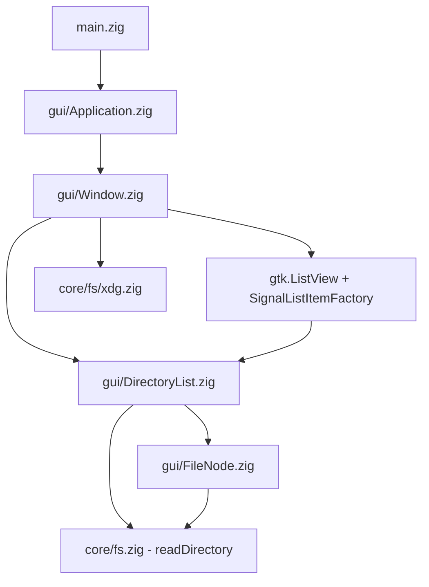

# Implementation Plan — Filebender Milestone 1: Bare Minimum Directory Browser

## Problem Statement

Build the simplest possible native Linux file manager: a libadwaita window that lists
file names in a directory and lets you navigate by clicking into directories or clicking
a "Go Up" button — using GObject-first patterns from Zig via `zig-gobject` bindings,
targeting Zig 0.16+.

## Design Decisions

### Toolkit: GTK4 + libadwaita

GTK4 is a C library with trivial FFI from Zig. libadwaita provides GNOME HIG compliance,
adaptive coloring, and dark mode for free. GNOME is the dominant DE on major Linux distros.
This matches the Ghostty precedent (GTK for Linux).

### Language: Zig

- `zig-gobject` provides generated type-safe GTK4/libadwaita bindings
- `std.os.linux.IoUring` for the async I/O engine (Milestone 3+)
- `std.fs` / `std.posix` for filesystem operations in core
- First-class C interop for the eventual C-ABI library export
- Comptime for GObject boilerplate reduction

### Concurrency Model

Three threads:

1. **Main thread** — GTK4 event loop. All UI access. Calls `filebender_dispatch()` when
   the engine's fd fires (via GSource). Reads `filebender_progress()` on frame ticks.
2. **Engine thread** — Drives io_uring ring via `std.os.linux.IoUring`. Pops submissions,
   submits SQEs, blocks on `io_uring_wait_cqe()`, writes completions, signals eventfd +
   futex. Created once at engine init.
3. **Worker threads** — Spawned via `std.Thread` per CPU-bound operation (search, checksums,
   compression). Die on completion.

Synchronization: lock-free SPSC/MPSC queues for submission/completion, `std.atomic` for
op status/progress/cancel, `std.Thread.Futex` for `filebender_wait()`, `std.Thread.RwLock`
for directory model and caches. No mutexes on the hot path.

For Milestone 1, all operations run synchronously on the main thread (directory listing
is fast enough). Engine thread introduced at Milestone 3 with file operations.

### Library Architecture

`core/` is designed from day one with library extraction in mind. It has zero GUI
dependencies and zero toolkit imports. However, the public C-ABI library (libfilebender)
is a post-1.0 formalization effort — the internal API will evolve freely until then.

## Requirements

- GTK4/libadwaita application using GObject type system via zig-gobject
- `zig-gobject` (upstream `ianprime0509/zig-gobject`) for generated bindings
- Directory listing via `std.fs` / `std.posix` in core (no GLib for filesystem ops)
- `FbFile` / `FbFileInfo` structs in core using `std.posix.Stat`
- Simple list view showing file names only
- Navigate into directories by clicking, navigate up via button
- Start at `$HOME` via XDG resolution
- Minimal runtime dependencies: only GTK4, libadwaita, and their transitive deps

## Architecture

### Two-Layer Split

- `core/` — Pure Zig, `std` only. Filesystem interaction, data types, formatting.
- `gui/` — All GLib/GTK/libadwaita code via zig-gobject. GObject wrappers, widgets, app lifecycle.

**Rule:** `gui/` imports from `core/`. `core/` never imports from `gui/` or any GLib/GTK module.

### Core Data Types

```zig
// core/fs/FbFileInfo.zig
pub const FbFileInfo = struct {
    size: u64,
    mode: u32,
    uid: std.posix.uid_t,
    gid: std.posix.gid_t,
    mtime: i128,            // nanosecond timestamp
    ctime: i128,

    pub fn fromStat(stat: std.posix.Stat) FbFileInfo { ... }
};

// core/fs/FbFile.zig
pub const FbFile = struct {
    kind: std.fs.File.Kind,
    info: FbFileInfo,
    path: []const u8,
    mime_type: ?[]const u8,
    symlink_target: ?[]const u8,

    pub fn basename(self: FbFile) []const u8 { ... }
    pub fn dirname(self: FbFile) ?[]const u8 { ... }
    pub fn isHidden(self: FbFile) bool { ... }
    pub fn isBackup(self: FbFile) bool { ... }
    pub fn deinit(self: *FbFile, allocator: std.mem.Allocator) void { ... }
};
```

### Project Structure

```
src/
  main.zig                      # Entry point
  root.zig                      # Library root (filebender module)

  core/                         # Pure Zig — std only
    fs.zig                      # Module root, readDirectory functions
    fs/
      FbFile.zig                # Filesystem entry struct
      FbFileInfo.zig            # Stat metadata struct
      xdg.zig                   # XDG directory resolution

  gui/                          # All GLib/GTK/libadwaita code
    main.zig                    # Module root
    Application.zig             # Custom AdwApplication subclass
    Window.zig                  # Custom AdwApplicationWindow subclass
    DirectoryList.zig           # GObject implementing gio.ListModel
    FileNode.zig                # GObject wrapping FbFile + display state
```

### Data Flow

```
core/fs.readDirectory(allocator, path)
  -> std.fs.openDirAbsolute(path)
  -> iterate entries via dir.iterate()
  -> std.posix.fstatat() each entry
  -> return []FbFile (plain Zig structs)

gui/DirectoryList (GObject implementing gio.ListModel)
  calls core.fs.readDirectory
  wraps each FbFile -> gui.FileNode (GObject with properties)

gui/Window (AdwApplicationWindow)
  binds DirectoryList to gtk.ListView
  displays file names
  handles click-to-navigate
```

### Dependency Diagram



## Task Breakdown

### Task 1: Project scaffolding and zig-gobject bindings

- **Objective:** Get the project building with zig-gobject on Zig 0.16
- Download `bindings-gnome49.tar.zst` from zig-gobject v0.3.1 release
- Extract as local directory (e.g. `deps/gobject/`)
- Add as local path dependency in `build.zig.zon`
- Configure `build.zig` to import modules: `glib`, `gobject`, `gio`, `gtk`, `adw`
- Create directory structure: `src/core/`, `src/gui/`
- Verify with minimal `const adw = @import("adw");`
- **Test:** `zig build` succeeds on Zig 0.16
- **Demo:** Project compiles without errors

### Task 2: Create custom AdwApplication subclass and empty window

- **Objective:** Establish the GObject-first application structure
- Create `src/gui/Application.zig` — custom GObject class extending `adw.Application`
  via `gobject.ext.defineClass`
- Implement `gio.Application.virtual_methods.activate` to create and present window
- Application ID: `"dev.kicanter.filebender"`
- Update `main.zig` to instantiate gui.Application and call `gio.Application.run()`
- **Test:** `zig build run` opens an empty libadwaita window
- **Demo:** Empty AdwApplicationWindow with "Filebender" title

### Task 3: Implement core filesystem layer

- **Objective:** Complete `core/` data types and directory reading
- Implement `FbFileInfo.fromStat()` — map `std.posix.Stat` fields
- Implement `FbFile` with `basename()`, `dirname()`, `isHidden()`, `isBackup()`
- Implement `readDirectory(allocator, path) ![]FbFile`:
  - `std.fs.openDirAbsolute(path)`
  - `dir.iterate()` to enumerate entries
  - `std.posix.fstatat()` each entry
  - Return allocated slice
- Implement `xdg.homeDir()` — `std.posix.getenv("HOME")`
- `FbFile.deinit(allocator)` for cleanup (free path, symlink_target)
- **Test:** Unit tests via `zig build test` against temp directory
- **Demo:** Tests pass

### Task 4: Create FileNode GObject wrapping FbFile

- **Objective:** Bridge core data into GObject type system
- Create `src/gui/FileNode.zig` — custom GObject class with properties:
  - `name` (string) — basename from FbFile.path
  - `kind` (uint) — from FbFile.kind
  - `size` (uint64) — from FbFile.info.size
- Constructor: `FileNode.newFromFbFile(file: FbFile) *FileNode`
- Register properties via `gobject.ext.defineProperty`
- **Test:** Create FileNode, verify properties readable via GObject API
- **Demo:** FileNode GObjects instantiate correctly

### Task 5: Create DirectoryList implementing gio.ListModel

- **Objective:** Data model that bridges core fs reading to GTK
- Create `src/gui/DirectoryList.zig` — custom GObject implementing `gio.ListModel`
- Has `path` property (string) for current directory
- When path set: call `core.fs.readDirectory()`, wrap each FbFile → FileNode
- Implement `gio.ListModel` virtual methods: `get_item`, `get_item_type`, `get_n_items`
- Fire `items-changed` signal on directory change
- **Test:** Point at known directory, verify item count
- **Demo:** DirectoryList enumerates $HOME correctly

### Task 6: Create Window with ListView showing file names

- **Objective:** Display directory contents in a visible list
- Create `src/gui/Window.zig` — custom `adw.ApplicationWindow` subclass
- Add `adw.HeaderBar` with current path as title
- Add "Go Up" button in header bar
- Create `gtk.ListView` inside `gtk.ScrolledWindow`
- Use `gtk.SignalListItemFactory` — setup/bind showing file name
- Connect DirectoryList as backing model via `gtk.SingleSelection`
- Initialize with $HOME from `core.fs.xdg`
- **Test:** `zig build run` shows window listing home directory
- **Demo:** Scrollable list of file names

### Task 7: Implement directory navigation

- **Objective:** Click to navigate into/out of directories
- Connect `gtk.ListView` activate signal — if directory, update DirectoryList path
- Wire "Go Up" button to navigate to parent (via `std.fs.path.dirname`)
- Update header bar title on navigation
- Handle edge cases: root directory (disable Go Up), empty directories
- Handle errors: permission denied → show inline message, don't crash
- **Test:** Navigate into subdirectory, verify list updates; navigate up, verify return
- **Demo:** Full directory browsing — open at $HOME, click into folders, Go Up to return
